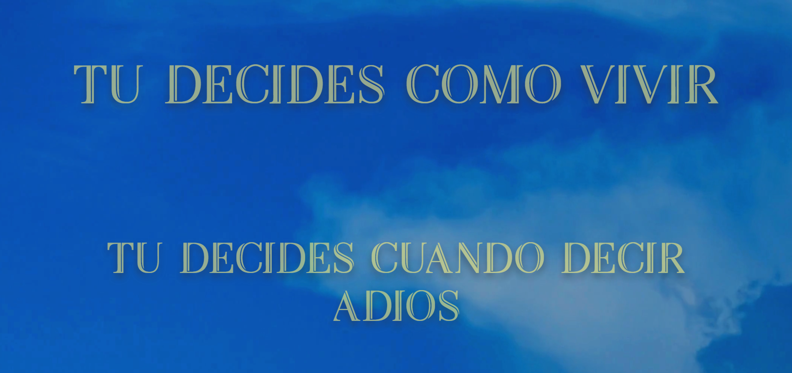
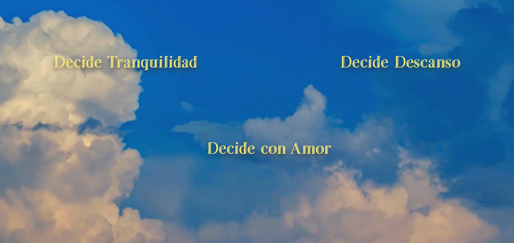
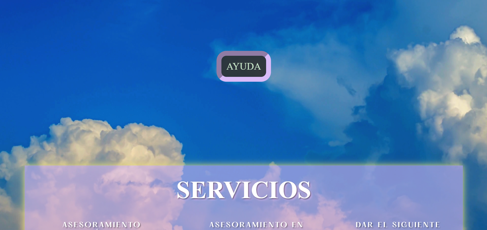
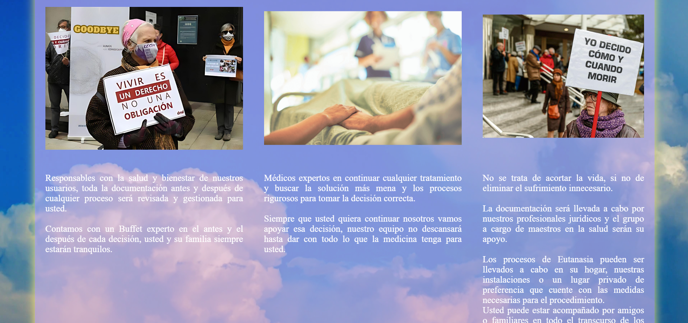

# GOODBYE  😸

## Descripción

GOODBYE es una landing page diseñada para informar sobre los servicios ofertados en GOODBYE y recolectar la información del interesado. Está dirigida a personas con enfermedades terminales o dolencias insoportables.

## Tabla de Contenidos

| Indice | Titulo |
| -- | --|
| 1 | Instalación |
| 2 | Uso |
| 3 | Estructura del Proyecto |
| 4 | Tecnologías Utilizadas |
| 5 | Contribuciones |
| 6 | Licencia |
| 7 | Autor|

## Instalación

Para ejecutar este proyecto localmente, sigue los siguientes pasos:

1. Clona este repositorio: [Presiona aqui](https://github.com/JhoanDiazArdila/PROYECTO-FILTRO_DIAZJHOAN)

2. Navega al directorio del proyecto:
   cd PROYECTO-FILTRO_DIAZJHOAN

3. Abre el proyecto con Visual Studio Code y utiliza la extensión Live Server para visualizarlo en un navegador compatible con HTML5 y CSS.

## Uso

Se debe leer la información y deslizar por la página, marcando las opciones necesarias. El footer dirige a los valores de la empresa.

## Estructura del Proyecto

La carpeta principal contiene todas las páginas necesarias, los videos y las imágenes. Adicionalmente, hay una carpeta 'Font' con las tipografías.

## Tecnologías Utilizadas

- HTML
- CSS
- JavaScript

## Contribuciones

Toda contribución es bien recibida y agradecemos el apoyo. Para contribuir, sigue estos pasos:

1. Haz un fork del proyecto.
2. Crea una nueva rama (git checkout -b feature/nueva-funcionalidad).
3. Realiza tus cambios y haz un commit (git commit -m 'Añadir nueva funcionalidad').
4. Envía tus cambios al repositorio (git push origin feature/nueva-funcionalidad).
5. Crea una solicitud de extracción (Pull Request).

## Licencia

MIT License

Permission is hereby granted, free of charge, to any person obtaining a copy
of this software and associated documentation files (the "Software"), to deal
in the Software without restriction, including without limitation the rights
to use, copy, modify, merge, publish, distribute, sublicense, and/or sell
copies of the Software, and to permit persons to whom the Software is
furnished to do so, subject to the following conditions:

The above copyright notice and this permission notice shall be included in all
copies or substantial portions of the Software.

THE SOFTWARE IS PROVIDED "AS IS", WITHOUT WARRANTY OF ANY KIND, EXPRESS OR
IMPLIED, INCLUDING BUT NOT LIMITED TO THE WARRANTIES OF MERCHANTABILITY,
FITNESS FOR A PARTICULAR PURPOSE AND NONINFRINGEMENT. IN NO EVENT SHALL THE
AUTHORS OR COPYRIGHT HOLDERS BE LIABLE FOR ANY CLAIM, DAMAGES OR OTHER
LIABILITY, WHETHER IN AN ACTION OF CONTRACT, TORT OR OTHERWISE, ARISING FROM,
OUT OF OR IN CONNECTION WITH THE SOFTWARE OR THE USE OR OTHER DEALINGS IN THE
SOFTWARE.

## Autor 😸

- Jhoan Sebastian Diaz Ardila  🥑

## Capturas de Pantalla

